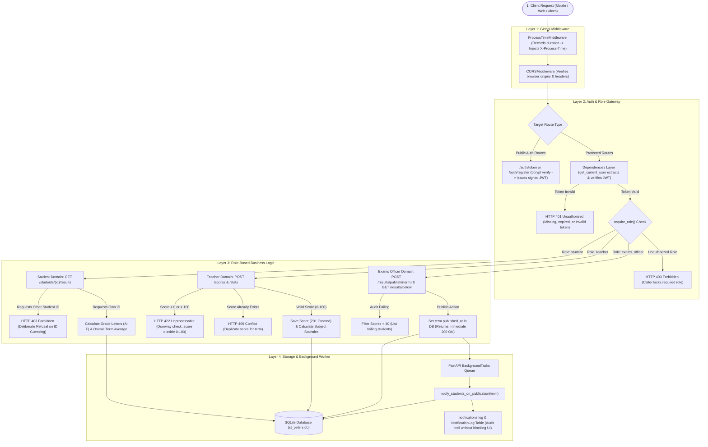

# Excalidraw Flowchart TD Code

Copy the code block below and paste it directly into [excalidraw.com](https://excalidraw.com).

### How to use in Excalidraw:
1. Open [excalidraw.com](https://excalidraw.com) in your browser.
2. In the top toolbar, click the **Three dots / More tools icon (`...`)** (or the `+` icon).
3. Select **Mermaid to Excalidraw**.
4. Paste the code below and click **Insert**.

