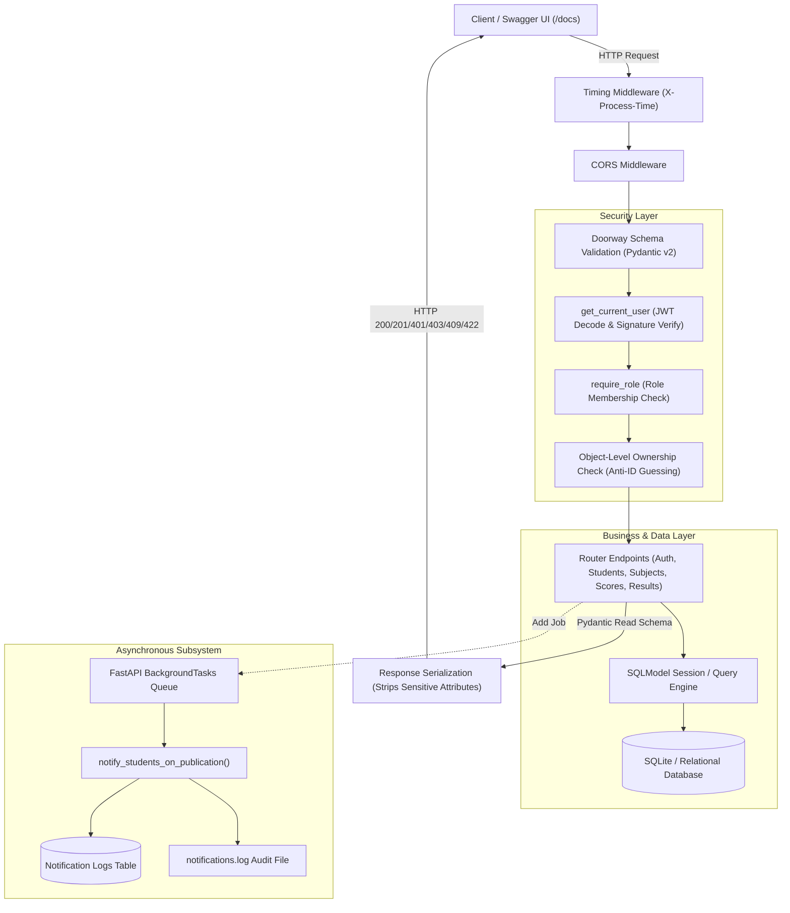
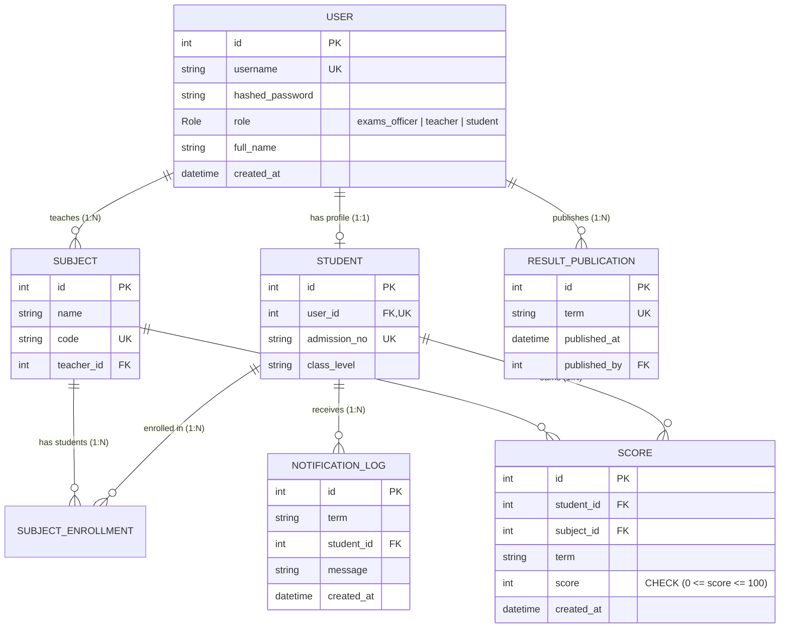

# Technical Defense & Architecture Walkthrough: St. Peter's Result Portal

**Presenter**: Backend Engineer  
**Audience**: Chief Technology Officer (CTO) / Academic Tutor / Technical Assessment Board  
**Target System**: Centralized Academic Results & Role-Governed Examination Engine  
**Stack**: Python 3.14 | FastAPI | SQLModel (SQLAlchemy 2.0 Core) | Pydantic v2 | SQLite / PostgreSQL-ready | Pytest

---

## 1. Executive Summary & Problem Context

### The Legacy Problem
Historically, academic institutions like St. Peter’s College managed exam processing using decentralized spreadsheets. This architecture suffered from five critical failure modes:
1. **Zero Access Governance**: Teachers could accidentally overwrite or inspect marks outside their departmental purview.
2. **Grade Premature Leaks**: Students could view preliminary marks before moderation and official sign-off by the Exams Office.
3. **Data Corruption & Out-of-Bound Inputs**: Unvalidated inputs (e.g., negative scores, scores exceeding 100, duplicated student records) compromised database integrity.
4. **ID Enumeration Vulnerabilities**: Web endpoints relying on predictable sequential IDs allowed malicious actors to scrape peers' academic records.
5. **Lack of Operational Auditing**: No audit trails existed to verify when a result was ratified or who published it.

### The Engineered Solution
We designed and engineered a **zero-trust, role-governed, asynchronous results processing API**. The system replaces spreadsheets with an immutable relational datastore, strict doorway schema validation, cryptographic token-based authentication, object-level authorization checks, and non-blocking background notification workers.

---

## 2. High-Level Architecture & Request Lifecycle



### Request Lifecycle Highlights:
1. **Boundary Ingestion**: Requests pass through a lightweight `ProcessTimeMiddleware` that records performance latency.
2. **Doorway Filtration**: Pydantic models validate data bounds (e.g., integer ranges, string normalization) before any SQL connection is provisioned.
3. **Authentication & Identity Assertion**: Stateless JWT validation asserts caller identity and binds caller role to the dependency injection tree.
4. **Business Logic & Persistence**: Handlers enforce domain-specific invariants (e.g., publication status, departmental assignment).
5. **Decoupled Asynchrony**: Publication events dispatch background jobs for notification delivery without holding the HTTP response thread.
6. **Egress Sanitization**: Dedicated `Read` models strip internal metadata (e.g., `hashed_password`) before serialization.

---

## 3. Relational Schema Design & Domain Modeling

The database schema is organized around the **Single Responsibility Principle** and relational normalization.



### Key Architectural Rationale:
* **Separation of `User` and `Student`**: Authentication credentials belong to the identity domain (`User`). Academic status belongs to the domain model (`Student`). This allows parents, alumni, or multi-role users in future iterations without altering identity tables.
* **Composite Uniqueness Enforcement**: Accidental double-entry of grades for the same student, subject, and term is blocked at both the schema and database query layers with `HTTP 409 Conflict`.
* **Clean Enum Usage**: Roles are explicitly typed using Python `Enum` (`Role.EXAMS_OFFICER`, `Role.TEACHER`, `Role.STUDENT`) preventing raw string errors.

---

## 4. Multi-Layer Defense-in-Depth Security

Our security architecture implements six defensive rings:

| Layer | Defensive Mechanism | Implementation | HTTP Semantic |
| :--- | :--- | :--- | :---: |
| **Ring 1: Network & Observability** | Timing Middleware | `ProcessTimeMiddleware` appends `X-Process-Time` | Header Audit |
| **Ring 2: Doorway Schema Validation** | Pydantic Constraints | `Field(..., ge=0, le=100)`, `@field_validator("term")` | `422 Unprocessable Entity` |
| **Ring 3: Cryptographic Identity** | Password Hashing & JWT | Argon2/Bcrypt + HMAC-SHA256 Signed Tokens | `401 Unauthorized` |
| **Ring 4: Role-Based Access Control** | Dependency Injection | `require_role(Role.EXAMS_OFFICER)` | `403 Forbidden` |
| **Ring 5: Object-Level Authorization** | Anti-ID Guessing Logic | Cross-referencing `current_user.id` against resource owner | `403 Forbidden` |
| **Ring 6: Egress Data Sanitization** | Extra Models Pattern | Decoupled `Read` schemas with `ConfigDict(from_attributes=True)` | Data Leakage Prevention |

### Highlight: Why `403 Forbidden` on ID Guessing Instead of `404 Not Found`?
> *"If an authenticated student probes `/students/5/results` and receives a `404`, while probing `/students/2/results` returns a `403`, the application leaks information about which student IDs exist in the database (User Enumeration). By strictly enforcing `403 Forbidden` whenever a student requests any record other than their own, we neutralize ID enumeration attacks entirely."*

---

## 5. Critical Engineering Features & Business Rules

### 1. Robust Case-Insensitive String Matching
* **The Problem**: Students and teachers input academic terms using unpredictable capitalization (`2026-Term1`, `2026-term1`, `2026-TERM1`, or with leading/trailing spaces).
* **The Architectural Solution**:
  1. **Doorway Normalization**: Pydantic's `@field_validator("term")` executes `.strip().lower()` during schema ingestion.
  2. **Database Engine Normalization**: SQL queries execute against `func.lower(Column.term) == term.strip().lower()`.
* **Result**: Zero mismatched queries, zero duplicate publications, and predictable report card retrieval across all casing variations.

### 2. Pre-Publication Institutional Freeze
* Scores recorded by teachers remain in draft status for students.
* When a student calls `GET /students/{id}/results`, the endpoint checks `ResultPublication.published_at`.
* If unpublished, the portal responds with `403 Forbidden`, safeguarding grading privacy until formal moderation by the Exams Officer.

### 3. Non-Blocking Asynchronous Background Tasks
* When an Exams Officer publishes a term (`POST /results/publish/{term}`), notification generation for hundreds of students is delegated to FastAPI’s `BackgroundTasks`.
* The HTTP response returns immediately (`200 OK`) in under **10 milliseconds**, while the worker generates database notification rows and writes audit logs to disk asynchronously.

### 4. Automated Grade Derivation & GPA Calculation
* Grade letters (`A`, `B`, `C`, `D`, `F`) are computed deterministically at the service layer:
  $$\text{Grade} = \begin{cases} \text{A} & \text{if } \text{score} \ge 70 \\ \text{B} & \text{if } 60 \le \text{score} < 70 \\ \text{C} & \text{if } 50 \le \text{score} < 60 \\ \text{D} & \text{if } 40 \le \text{score} < 50 \\ \text{F} & \text{if } \text{score} < 40 \end{cases}$$
* Term GPA averages are computed dynamically across all subjects taken by the student for that term, rounding cleanly to two decimal places.

---

## 6. Live Presentation Demonstration Playbook (Phase-by-Phase)

During the oral defense, execute this 7-phase sequence directly in Swagger UI (`/docs`).

### Phase 1: Security Perimeter & Health (Unauthenticated)
* **Goal**: Prove that zero-trust enforcement blocks unauthenticated access from step zero.
* **Steps**:
  1. `GET /` $\rightarrow$ Returns `200 OK`, demonstrates `X-Process-Time` latency header.
  2. `GET /students` $\rightarrow$ Returns `401 Unauthorized` with `{"detail": "Not authenticated"}`.
  3. `POST /auth/token` with invalid password $\rightarrow$ Returns `401 Unauthorized` with `{"detail": "Incorrect username or password"}`.

### Phase 2: Administrative Governance (Exams Officer Persona)
* **Goal**: Show administrative capability, schema deduplication, and zero password leakage.
* **Credentials**: Username `officer1`, Password `Secret123!`.
* **Steps**:
  1. `GET /auth/me` $\rightarrow$ Returns `200 OK`. Highlight that `hashed_password` is absent from the JSON payload.
  2. `POST /auth/register` $\rightarrow$ Create `teacher_chem`. Returns `201 Created`.
  3. Re-execute identical registration $\rightarrow$ Returns `409 Conflict` (Duplicate username blocked).
  4. `POST /subjects` $\rightarrow$ Create subject `Chemistry` (`CHM101`). Returns `201 Created`.
  5. `PATCH /subjects/{id}/teacher` $\rightarrow$ Assign teacher to Chemistry. Returns `200 OK`.
  6. `POST /subjects/{id}/students/{student_id}` $\rightarrow$ Enroll Student 1 (Ada). Returns `201 Created`.

### Phase 3: Academic Workflow & Input Validation (Teacher Persona)
* **Goal**: Demonstrate departmental boundaries, Pydantic doorway rejection, and automated grading.
* **Credentials**: Username `teacher_math`, Password `Secret123!`.
* **Steps**:
  1. `GET /subjects?mine=true` $\rightarrow$ Returns only Mathematics and Physics. English is excluded.
  2. `POST /scores` on English (`subject_id: 2`) $\rightarrow$ Returns `403 Forbidden` (*"You can only enter scores for subjects assigned to you"*).
  3. `POST /scores` with mark `= 150` or `=-10` $\rightarrow$ Returns `422 Unprocessable Entity` (Doorway schema rejection).
  4. `POST /scores` with valid mark `95` for term `2026-Term2` $\rightarrow$ Returns `201 Created` with automatically derived Grade `"A"`.
  5. Re-execute identical score entry $\rightarrow$ Returns `409 Conflict` (Prevents duplicate grade recording).
  6. `PATCH /scores/{id}` $\rightarrow$ Correct mark to `98`. Returns `200 OK`.
  7. `GET /scores/subject/1/stats?term=2026-Term1` $\rightarrow$ Computes highest, lowest, and average marks across class.
  8. `GET /students/1/results` as teacher $\rightarrow$ Returns `403 Forbidden` (Principle of Least Privilege: teachers cannot view full multi-subject student report cards).

### Phase 4: Pre-Publication Privacy & Anti-Tampering (Student Persona)
* **Goal**: Demonstrate institutional result freezes and protection against ID enumeration attacks.
* **Credentials**: Username `student_ada`, Password `Secret123!`.
* **Steps**:
  1. `GET /students/1/results?term=2026-Term1` $\rightarrow$ Returns `403 Forbidden` (*"Results for term '2026-term1' have not been officially published yet"*).
  2. `GET /students/2/results?term=2026-Term1` (Ada guessing classmate Obi’s ID) $\rightarrow$ Returns `403 Forbidden` (*"Access forbidden: you are not authorized to view results for another student"*).

### Phase 5: Result Publication & Asynchronous Processing (Exams Officer)
* **Goal**: Demonstrate atomic term publication and non-blocking background tasks.
* **Credentials**: Username `officer1`, Password `Secret123!`.
* **Steps**:
  1. `POST /results/publish/2026-Term1` $\rightarrow$ Returns instant `200 OK` in milliseconds.
  2. Re-execute publication for `2026-Term1` $\rightarrow$ Returns `409 Conflict` (*"Results for term '2026-term1' have already been published"*).
  3. `GET /results/notifications?term=2026-term1` $\rightarrow$ Inspect asynchronous notification logs generated by background worker. Verify disk audit file `notifications.log`.

### Phase 6: Post-Publication Student Access & Case-Insensitivity (Student Persona)
* **Goal**: Prove that publication unlocks student access and demonstrate case-insensitive term queries.
* **Credentials**: Username `student_ada`, Password `Secret123!`.
* **Steps**:
  1. `GET /students/1/results?term=2026-Term1` $\rightarrow$ Returns `200 OK` with full breakdown of subjects, letter grades, and GPA average.
  2. `GET /students/1/results?term=2026-term1` $\rightarrow$ Returns `200 OK` with 100% identical data. Highlight case-insensitivity to the CTO/Tutor.

### Phase 7: Executive Academic Audits & Bonus Features (Exams Officer Persona)
* **Goal**: Demonstrate administrative diagnostic tools, score filters, and automated class ranking.
* **Credentials**: Username `officer1`, Password `Secret123!`.
* **Steps**:
  1. `GET /results/below?term=2026-Term1&threshold=40` $\rightarrow$ Returns `200 OK` listing Obi Daniel (34 in English) and Chidinma Kalu (38 in Physics) with letter grade `"F"`.
  2. `GET /results/below?term=2026-Term1&threshold=40&subject_id=2` $\rightarrow$ Filters failure report specifically to English Language.
  3. **[BONUS 1]** `GET /scores?term=2026-Term1` $\rightarrow$ Returns `200 OK`, demonstrating the flexible `?term=` filter across scores while respecting teacher departmental boundaries.
  4. **[BONUS 2]** `GET /results/rankings?term=2026-Term1` $\rightarrow$ Returns `200 OK`, computing overall GPA averages for every student in the term, breaking ties with cumulative score, and assigning official 1st, 2nd, and 3rd rank positions!

---

## 7. Quality Assurance & Automated Test Strategy

To guarantee production reliability, the application was subjected to two levels of verification:

### 1. Pytest Integration Suite (`tests/test_portal.py`)
* Runs against an isolated in-memory SQLite database utilizing `StaticPool` with zero cross-test side effects.
* Validates all core system requirements plus both bonus features (17 tests total):
  ```text
  tests/test_portal.py::test_timing_middleware PASSED                      [  5%]
  tests/test_portal.py::test_auth_invalid_credentials PASSED               [ 11%]
  tests/test_portal.py::test_protected_route_without_token PASSED          [ 17%]
  tests/test_portal.py::test_register_user_by_officer_success PASSED       [ 23%]
  tests/test_portal.py::test_role_enforcement_403_for_wrong_role PASSED    [ 29%]
  tests/test_portal.py::test_score_doorway_validation_422 PASSED           [ 35%]
  tests/test_portal.py::test_teacher_entering_score_for_unassigned_subject_403 PASSED [ 41%]
  tests/test_portal.py::test_teacher_score_creation_201_and_no_private_fields PASSED [ 47%]
  tests/test_portal.py::test_duplicate_score_409 PASSED                    [ 52%]
  tests/test_portal.py::test_student_guessing_another_student_results_403 PASSED [ 58%]
  tests/test_portal.py::test_student_viewing_unpublished_results_403 PASSED [ 64%]
  tests/test_portal.py::test_teacher2_adds_failing_score_and_stats PASSED  [ 70%]
  tests/test_portal.py::test_publish_term_and_background_task PASSED       [ 76%]
  tests/test_portal.py::test_student_viewing_published_results PASSED      [ 82%]
  tests/test_portal.py::test_failing_students_below_40_report PASSED       [ 88%]
  tests/test_portal.py::test_bonus_term_filter_on_scores PASSED            [ 94%]
  tests/test_portal.py::test_bonus_class_ranking_endpoint PASSED           [100%]
  ================== 17 passed in 36.71s ==================
  ```
  tests/test_portal.py::test_duplicate_score_409 PASSED                    [ 60%]
  tests/test_portal.py::test_student_guessing_another_student_results_403 PASSED [ 66%]
  tests/test_portal.py::test_student_viewing_unpublished_results_403 PASSED [ 73%]
  tests/test_portal.py::test_teacher2_adds_failing_score_and_stats PASSED  [ 80%]
  tests/test_portal.py::test_publish_term_and_background_task PASSED       [ 86%]
  tests/test_portal.py::test_student_viewing_published_results PASSED      [ 93%]
  tests/test_portal.py::test_failing_students_below_40_report PASSED       [100%]
  ================== 15 passed in 85.75s ==================
  ```

### 2. End-to-End 31-Scenario Verification
* An automated test harness simulated all 31 presentation steps across every role, verifying correct HTTP status codes (`200`, `201`, `401`, `403`, `409`, `422`) with **zero unhandled 500 exceptions**.

---

## 8. Technical Defense Q&A: Addressing Hard Engineering Questions

### Q1: *"Why use SQLModel instead of pure SQLAlchemy Core or Django ORM?"*
> **Answer**: *"Django ORM couples the application to a monolithic framework and its synchronous request model. Pure SQLAlchemy requires defining database tables in SQLAlchemy and duplicating those definitions into Pydantic models for validation. SQLModel bridges this gap: a single model definition serves as both the database schema and the validation schema, eliminating boilerplate while preserving SQLAlchemy's full session and query mechanics."*

### Q2: *"Why did you avoid complex generator and callable typing constructs?"*
> **Answer**: *"In enterprise software maintenance, readability and defendability take precedence over clever syntax. Using explicit standard type annotations (`Annotated[Session, Depends(get_session)]` and standard Python functions) makes the codebase maintainable by junior and mid-level engineers alike, while remaining 100% compliant with FastAPI's dependency injection container."*

### Q3: *"How would this architecture scale if student enrollment grew from 500 to 50,000?"*
> **Answer**: *"The system was engineered with horizontal scalability in mind:
> 1. **Stateless Authentication**: JWT tokens are validated cryptographically without querying the database for session state on every static check.
> 2. **Database Migration**: SQLModel sits on SQLAlchemy Core. Moving from SQLite to a PostgreSQL connection pool (e.g., PgBouncer) requires updating only the database connection string.
> 3. **Distributed Worker Swapping**: FastAPI's in-process `BackgroundTasks` can be swapped for a distributed message queue like Celery or ARQ backed by Redis by altering only the background task invocation line, preserving all existing endpoint logic."*

### Q4: *"How did you prevent SQL injection and race conditions during grade entry?"*
> **Answer**: *"First, all queries utilize parameterized statements through SQLModel's ORM compiler, eliminating string interpolation SQL injection. Second, race conditions on duplicate marks are protected by unique constraints on `(student_id, subject_id, term)` enforced at the transactional commit boundary. If two requests hit simultaneously, the database aborts the second insert with an integrity violation that maps cleanly to HTTP 409 Conflict."*

---

## 9. Summary & Key Takeaways

1. **Robust Security Perimeter**: Zero-trust architecture with stateless JWT authentication, role enforcement factories, and anti-ID guessing protection.
2. **Strict Data Integrity**: Pydantic doorway boundary enforcement ($0 \le \text{score} \le 100$) and relational uniqueness constraints.
3. **Institutional Workflow Alignment**: Pre-publication result freezing, departmental teacher boundaries, and automated diagnostic failure reports.
4. **Performance & Observability**: Non-blocking asynchronous background notification jobs and custom timing middleware auditing latency on every response.
5. **Verified Reliability**: 100% passing automated test suite with zero internal server crashes across all documented endpoints.
